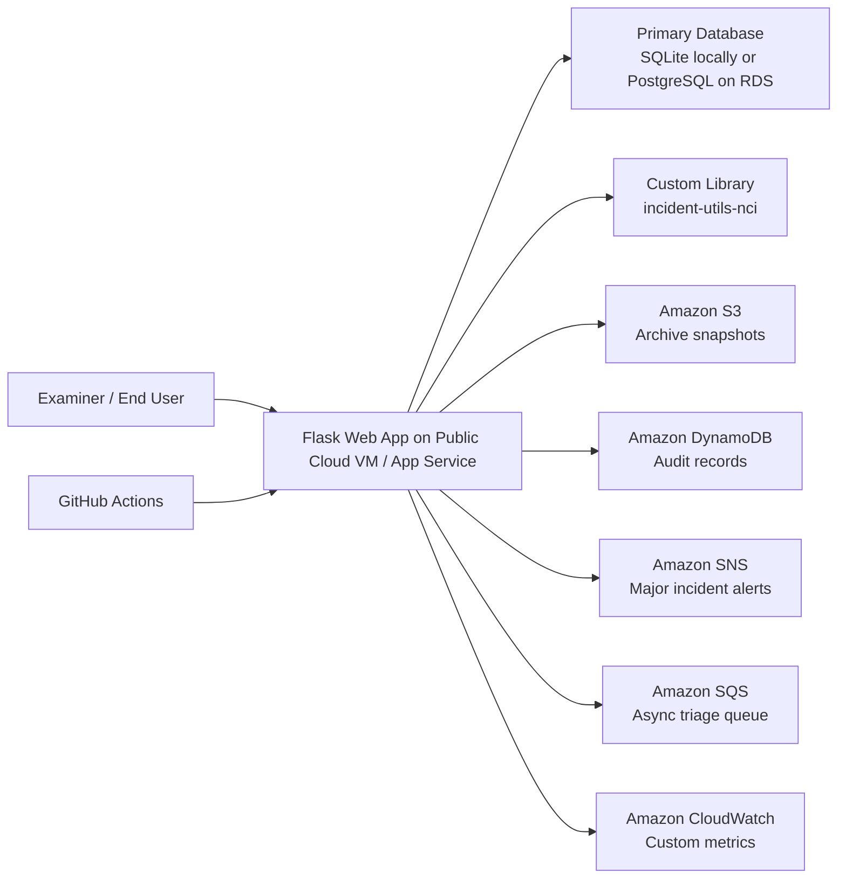

# Architecture Diagram

## Architectural patterns used

- Stateless web tier: request handling is separated from durable storage and cloud integrations.
- Managed service integration: core operational concerns are delegated to cloud-native services.
- Queue-based load leveling: SQS supports asynchronous follow-up work.
- Event-driven notification: SNS is triggered on major or resolved incidents.
- Polyglot persistence: relational database for transactional incident data, DynamoDB for audit history, S3 for immutable snapshots.
